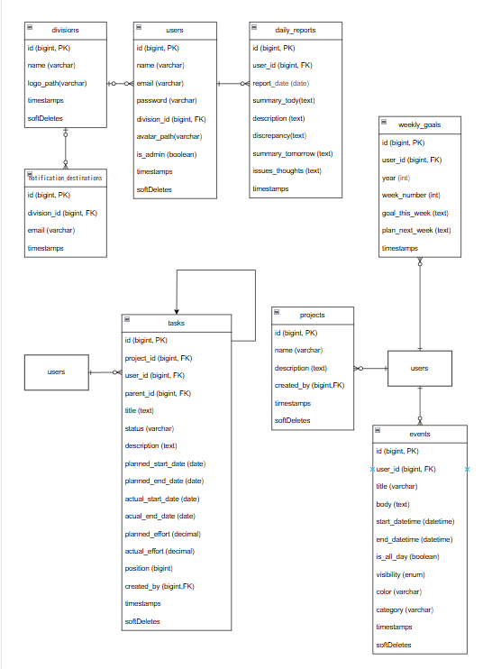
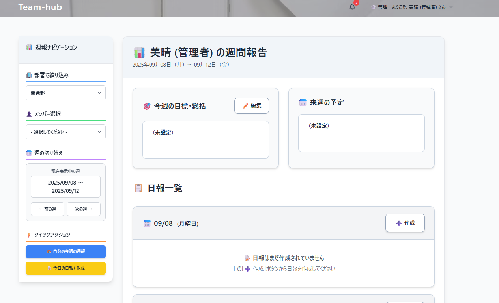
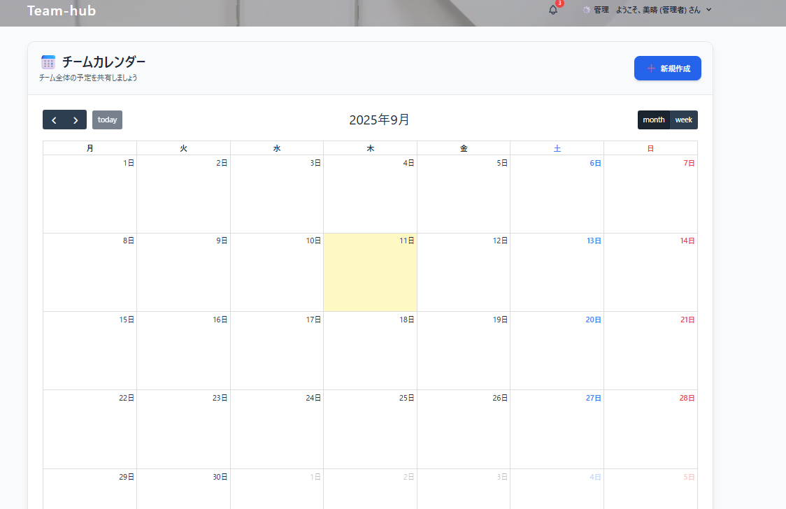
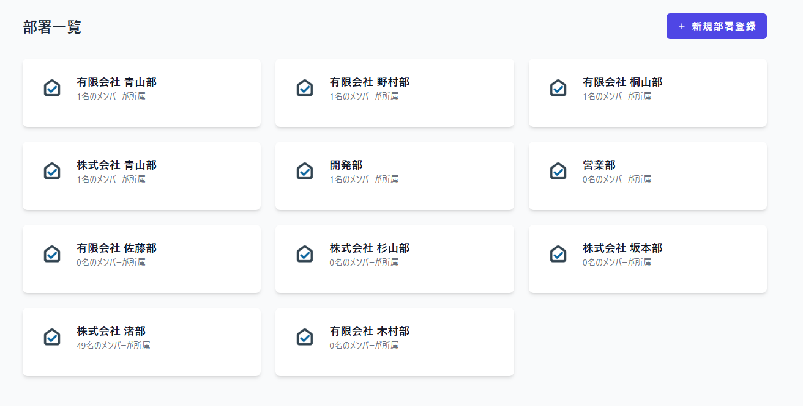

# TeamHub - 最高のチームのための、オールインワン・ワークスペース

## 1. 概要 (Overview)

**TeamHub**は、「Excelとメール連絡からの解放」をコンセプトに開発された、チーム内の情報共有と業務プロセスを効率化するためのオールインワン・ワークスペースです。

日報、WBS、ガントチャート、スケジュール、ナレッジ共有など、チーム内に散在しがちな情報を一元管理し、直感的で美しいインターフェースで業務改善をサポートします。

これは単なるポートフォリオではなく、「チームをこう変えたい」という強い意志を形にした、実用的なアプリケーションです。


## 2. 主な機能 (Features)

### プロジェクト・タスク管理
- **WBS (階層型タスク管理)**: 親子関係を持つタスクを階層で管理し、プロジェクトの全体像を明確化。
- **インタラクティブ・ガントチャート**: `dhtmlx-gantt` を活用し、タスクのスケジュールと進捗を視覚的に表示。ドラッグ＆ドロップでの期間変更や並び替えにも対応。
- **WBS/ガントチャート表示切替**: ワンクリックで2つのビューをスムーズに切り替え可能。
- **進捗管理**: `todo`, `in_progress`, `done` のステータス管理と、プロジェクト全体のリアルタイム進捗サマリー表示。

### 日報・週報ハブ
- 日報作成・編集・閲覧。
- ユーザーごとの週報（週間目標と日報のサマリー）表示。
- 日報提出時に部署ごとの指定メールアドレスへ自動通知。


### スケジュールハブ
- `FullCalendar.js` を利用した、チームメンバー共有のインタラクティブなカレンダー。
- 予定のCRUD操作、終日フラグ、公開範囲（公開/プライベート）設定。
- ドラッグ＆ドロップによる直感的な日付・期間変更。


### ナレッジハブ
- 議事録やマニュアルなど、チームの知識資産をストック・共有。
- キーワードやカテゴリによる強力な検索・フィルタリング機能。
- 重要記事のピン留め機能。


### 管理者機能
- ユーザー管理（権限変更・削除）。
- 部署管理（通知先メールアドレス設定含む）。


## 3. 技術スタック (Tech Stack)

### バックエンド
- **PHP**: 8.2
- **Laravel**: 10.x
- **データベース**: MySQL 8.0
- **キャッシュ**: Redis
- **認証**: Laravel Breeze

### フロントエンド
- **JavaScript (Vanilla JS)**: モーダル制御、AJAX通信、DOM操作
- **CSS**: Tailwind CSS 3.x
- **UIライブラリ**:
  - **dhtmlx-gantt**: ガントチャート機能
  - **FullCalendar.js**: スケジュール機能

### 開発・本番環境
- **開発環境**: Docker, Laravel Sail (WSL2)
- **テスト**: PHPUnit (Feature Test)
- **本番環境想定**: AWS EC2 / Nginx / MySQL / Redis

## 4. 環境構築 (Installation)

### 前提条件
- Docker Desktop がインストールされていること。
- Windowsの場合、WSL2が有効になっていること。
- Git, Node.js, npmがインストールされていること。

### 手順
1.  **リポジトリをクローン**
    ```bash
    git clone https://github.com/your-username/teamhub.git
    cd teamhub
    ```

2.  **Laravel Sailのエイリアスを設定（推奨）**
    ```bash
    alias sail='[ -f sail ] && bash sail || bash vendor/bin/sail'
    ```

3.  **`.env` ファイルの準備**
    `.env.example` をコピーして `.env` ファイルを作成します。
    ```bash
    cp .env.example .env
    ```

4.  **Dockerコンテナの起動と依存パッケージのインストール**
    ```bash
    # 初回のみ実行
    sail up -d
    sail composer install
    sail npm install
    ```

5.  **アプリケーションキーの生成**
    ```bash
    sail artisan key:generate
    ```

6.  **データベースのマイグレーション**
    データベースのテーブルを作成し、初期データを投入します。
    ```bash
    # テーブル作成
    sail artisan migrate

    # （もしあれば）初期データ投入
    sail artisan db:seed
    ```

7.  **フロントエンドアセットのビルド**
    ```bash
    sail npm run dev
    ```

8.  **アプリケーションへアクセス**
    ブラウザで `http://localhost` にアクセスしてください。

## 5. テストの実行

PHPUnitを使用した機能テストを実行できます。
```bash
sail artisan test
```

## 6. 今後の展望 (Future Plans)

- **【高優先度】**: カンバンボード表示、タスク間依存関係、ファイル添付機能
- **【中優先度】**: 工数分析レポート、コメント機能
- **【低優先度】**: AIアシスタントによる進捗予測、外部ツール連携（Slack, GitHub）

---
